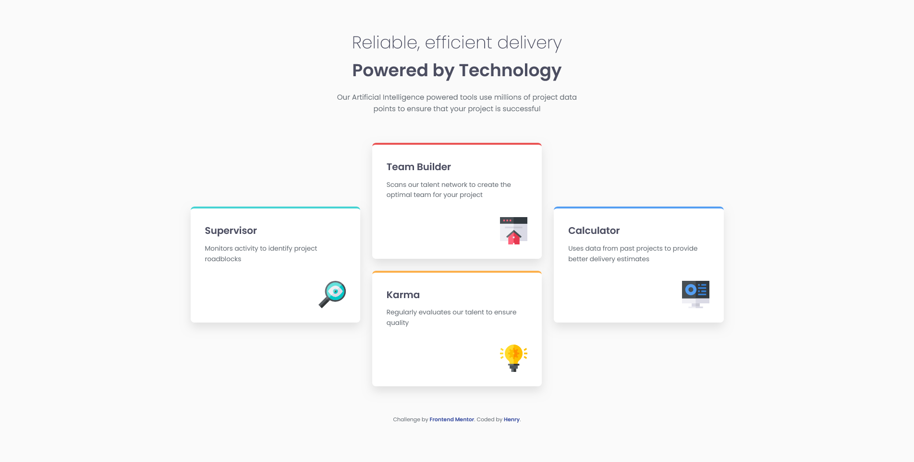

# Frontend Mentor - Four card feature section solution

This is a solution to the [Four card feature section challenge on Frontend Mentor](https://www.frontendmentor.io/challenges/four-card-feature-section-weK1eFYK).

## Table of contents

- [Overview](#overview)
  - [The challenge](#the-challenge)
  - [Screenshot](#screenshot)
  - [Links](#links)
- [My process](#my-process)
  - [Built with](#built-with)
  - [What I learned](#what-i-learned)
  - [Continued development](#continued-development)  
- [Author](#author)

**Note: Delete this note and update the table of contents based on what sections you keep.**

## Overview

### The challenge

Users should be able to:

- View the optimal layout for the site depending on their device's screen size

### Screenshot



### Links

- Solution URL: [https://github.com/Henrydevlab/four-card-feature-section](https://github.com/Henrydevlab/four-card-feature-section)
- Live Site URL: [https://henrydevlab.github.io/four-card-feature-section/](https://henrydevlab.github.io/four-card-feature-section/)

## My process

### Built with

- Semantic HTML5 markup
- CSS custom properties
- Flexbox
- CSS Grid
- Mobile-first workflow
- Google Fonts (Poppins)

### What I learned

I practiced using CSS Grid to create a non-standard layout. Specifically, I learned how to use grid row and column spanning to achieve the "staircase" effect for the four cards on desktop screens.

Highlight of the Grid structure:
```css
@media (min-width: 950px) {
  .container {
    display: grid;
    grid-template-columns: repeat(3, 1fr);
    grid-template-rows: repeat(4, 1fr);
    align-items: center;
  }

  .card--cyan { grid-column: 1; grid-row: 2 / 4; }
  .card--red { grid-column: 2; grid-row: 1 / 3; }
  .card--orange { grid-column: 2; grid-row: 3 / 5; }
  .card--blue { grid-column: 3; grid-row: 2 / 4; }
}
```

### Continued development

I want to continue focusing on refining my CSS Grid skills, particularly for asymmetrical layouts, and ensuring high performance when loading custom web fonts like Poppins.

## Author

- Frontend Mentor - [@henrydevlab](https://www.frontendmentor.io/profile/henrydevlab)
- Twitter - [@henrydevlab](https://www.twitter.com/henrydevlab)